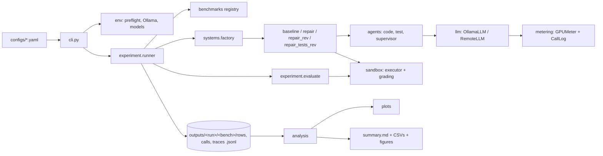

# Design: turning the M1 notebooks into a reusable, runnable repository

**Status:** proposal, awaiting approval. No code has been moved yet.
**Source of truth for the refactor:** the v3e notebooks on `milestone-1`
(`07_m1-v3e-part-a-mbpp-humaneval.ipynb`, `08_m1-v3e-part-b-livecodebench.ipynb`), built from
`milestone-1/src/cells/*` by `milestone-1/src/build.py`.

---

## 1. Goals

1. **Clone and run.** Anyone can `git clone` the repo and run the full M1 experiment on their own Linux or macOS
   machine with a GPU, or in Docker, with no notebook involved.
2. **Same results as the notebooks.** The refactor changes structure, not behaviour. Prompts, seeds, cache keys,
   sampling, grading, metering and statistics are copied as they are. Section 9 describes the equivalence check.
3. **One codebase, many runs.** Part A / Part B, the smoke test and future milestones are configs, not copies of
   the code.
4. **Run and analysis are separate.** Analysis and figures run on CPU from saved outputs, for example from a
   Kaggle results zip.
5. **Kaggle still works.** A thin notebook installs the package and calls the CLI.

**Non-goals for this refactor.** No new experimental features. The open items in `IMPLEMENTATION_LOG.md` §7
(raise `NUM_PREDICT` to 1024, keep-the-best, Best-of-N arm, pre-registered primary comparison, ...) stay out of
this refactor. Each one comes later as its own commit on top of a package that matches v3e.

---

## 2. Repository layout

```
coding_agents/
├── README.md                    # what this is + quickstart (clone → setup → smoke → run → analyze)
├── DESIGN.md                    # this file
├── LICENSE
├── pyproject.toml               # `pip install -e .` installs the package and the `coding-agents` command
├── requirements.txt             # pinned versions for reproducibility
├── Makefile                     # make setup / check / smoke / run / analyze / test / docker-*
├── .env.example                 # optional KIMI_API_KEY, OLLAMA_HOST, OUTPUT_ROOT
├── .gitignore                   # outputs/, .venv/, caches, *.zip
│
├── configs/
│   ├── base.yaml                # every default, identical to v3e section 3
│   ├── m1_part_a.yaml           # MBPP+ 120 + HumanEval+ 164   (= notebook 07)
│   ├── m1_part_b.yaml           # LiveCodeBench 100            (= notebook 08)
│   ├── m1_small_gpu.yaml        # qwen2.5-coder:7b writer + 3b reviewer, for a single 12–16 GB GPU
│   └── smoke.yaml               # 5 questions per benchmark, 3b models, ALLOW_SMALL_N – end-to-end in minutes
│
├── docker/
│   ├── Dockerfile               # Python 3.11 + package; entrypoint = coding-agents
│   ├── Dockerfile.sandbox       # minimal image for the docker sandbox backend
│   └── docker-compose.yml       # services: ollama (GPU, model volume) + app (mounts ./outputs)
│
├── scripts/
│   ├── setup_local.sh           # native path: venv, pip install, Ollama install, pull models from a config
│   └── pull_models.sh           # pulls exactly the models a config names
│
├── src/coding_agents/
│   ├── __init__.py
│   ├── cli.py                   # argparse entry point (section 5)
│   ├── config.py                # dataclasses, YAML loading, --set overrides, config hash
│   │
│   ├── env/
│   │   ├── platform.py          # §1 environment report, §4 Kaggle preflight
│   │   ├── ollama_server.py     # §5 install/start server, §6 ensure_model, probe, residency check, warm-up
│   │   └── kaggle.py            # §3b restore-from-input, Kaggle paths and secrets (imported only on Kaggle)
│   │
│   ├── llm/
│   │   ├── base.py              # ChatModel protocol: chat(system, user) -> (text, seconds, cached)
│   │   ├── ollama.py            # OllamaLLM with metering built in (replaces the monkey-patch)
│   │   ├── remote.py            # §9b RemoteLLM (Kimi presets), RemoteQuotaError, disk cache
│   │   └── parsing.py           # extract_code, extract_asserts
│   │
│   ├── metering/
│   │   ├── gpu_meter.py         # §13 GPUMeter (NVML energy counter / power integration), idle calibration
│   │   └── call_log.py          # §14 CallLog, role context manager, cost_slice, tag_calls
│   │
│   ├── sandbox/
│   │   ├── runner.py            # RUNNER_SRC as a real module; executed inside the child process
│   │   ├── executor.py          # run_in_sandbox, rlimits, backend switch (subprocess | docker)
│   │   └── grading.py           # run_suite (memoised), grade_hidden, passes_public, first_error, classify_failure
│   │
│   ├── benchmarks/
│   │   ├── base.py              # Problem dataclass (the dict keys the notebook uses today)
│   │   ├── common.py            # §7 wrap_composite_test, extract_call_signature, sample_main_set, validate_public
│   │   ├── evalplus.py          # MBPP+ and HumanEval+ (docstring public tests)
│   │   ├── livecodebench.py     # date window, functional vs stdin, private-case decoding
│   │   └── registry.py          # "mbpp_plus" | "humaneval_plus" | "livecodebench" -> loader
│   │
│   ├── agents/
│   │   ├── prompts.py           # every system and user prompt, verbatim from v3e
│   │   ├── code_agent.py        # CodeGenerationAgent
│   │   ├── test_agent.py        # TestGenerationAgent
│   │   └── supervisor.py        # SupervisorAgent (self-review or reviewer)
│   │
│   ├── systems/
│   │   ├── baseline.py          # BaselineSystem
│   │   ├── repair.py            # §11 MultiAgentOrchestrator
│   │   └── factory.py           # build_systems: one shared code-model client -> one shared first draft
│   │
│   ├── experiment/
│   │   ├── storage.py           # crash-safe JSONL append/read, load_saved (run_uid dedup), restore
│   │   ├── evaluate.py          # _evaluate, evaluate_question
│   │   └── runner.py            # §16 resume, session budget, rows.jsonl written last as commit marker
│   │
│   ├── analysis/                # CPU only; input = an outputs directory or a results zip
│   │   ├── load.py              # outputs dir / zip -> ALL, CALLS dataframes
│   │   ├── metrics.py           # §17 pass@1, Wilson CI, cost units, false-accept
│   │   ├── stats.py             # §18 exact McNemar, Holm, do-no-harm, n ≥ 45
│   │   ├── test_agent.py        # §19
│   │   ├── regressions.py       # §19b regressions + keep-the-best re-score
│   │   ├── walkthrough.py       # §19c
│   │   ├── lcb_regrade.py       # §19d
│   │   ├── agent_costs.py       # §21
│   │   ├── cost_model.py        # §22 per-call model, power by role, Spearman + bootstrap
│   │   └── report.py            # §23 summary.md
│   │
│   └── plots/
│       ├── style.py             # palette, rcParams, header(), save()
│       └── figures.py           # fig_01 … fig_12, one function each
│
├── notebooks/
│   └── kaggle_m1.ipynb          # thin: clone/pip install, `coding-agents check`, `run`, `analyze`, `package`
│
├── tests/
│   ├── test_sandbox.py          # the 4 self-checks from §8 + timeout + memory limit + stdin numeric tolerance
│   ├── test_grading.py          # first_error / classify_failure on fixed tracebacks
│   ├── test_benchmarks.py       # wrap_composite_test, signature hints, HumanEval docstring tests, sampling
│   ├── test_storage.py          # truncated-tail JSONL, run_uid dedup, resume
│   ├── test_stats.py            # McNemar, Holm, Wilson against known values
│   ├── test_parsing.py          # extract_code / extract_asserts
│   └── test_pipeline_fake_llm.py# full question through every system with a scripted fake LLM (no GPU)
│
└── milestone-1/                 # unchanged: notebooks 01–08, IMPLEMENTATION_LOG.md, src/cells (history)
```

`milestone-1/` stays as it is. Its notebooks and the cell sources are the historical record. The package at the
root becomes the code that future runs use.

---

## 3. How the pieces connect



Dependency rule, enforced by a test: lower layers never import higher ones.
`sandbox`, `metering`, `llm` ← `agents` ← `systems` ← `experiment` ← `cli`. `analysis` only reads files.

### What changes from notebook globals to explicit objects

| Notebook (v3e) | Package |
|---|---|
| ~60 module-level constants in section 3 | one `Config` dataclass loaded from YAML, passed down |
| `CALL_LOG`, `_CURRENT_ROLE` globals | a `CallLog` object owned by the run and passed to each LLM client |
| `OllamaLLM.chat = _metered_chat` monkey-patch | metering is part of `OllamaLLM.chat`, behaviour identical |
| `_tag_role` wrappers on agent methods | agents open `call_log.role("generator")` explicitly |
| `M1_CONFIG["N_GPUS"]`, `IDLE_WATTS` globals | a `HardwareProfile` measured once per run and stored in `m1_config.json` |
| `_GRADE_CACHE` global | cache owned by a `Grader` instance (same SHA-256 key) |
| `globals().get("FEEDBACK_MODE")` inside `first_error` | passed as an argument |
| `M1_PART` | `--config configs/m1_part_a.yaml` or `--benchmarks ...` |
| §3b restore from `/kaggle/input` | `coding-agents run --resume-from <dir or zip>` (works anywhere, same settings check) |

---

## 4. Configuration

YAML mirrors the section-3 names (lower-case) so the implementation log stays readable against it.

```yaml
# configs/m1_part_a.yaml
extends: base.yaml
run_name: m1_part_a
benchmarks: [mbpp_plus, humaneval_plus]
n_problems: {mbpp_plus: 120, humaneval_plus: null}
```

```yaml
# configs/base.yaml (excerpt; every key and value matches v3e)
model:      {name: "qwen3-coder:30b", temperature: 0.1, seed: 42,
             num_predict: 512, num_predict_lcb: 2048, num_ctx: 8192, keep_alive: "24h"}
reviewer:   {backend: local, model: "qwen2.5-coder:7b"}      # backend: local | kimi
kimi:       {provider: openrouter, model: null, thinking: false, temperature: 0.6,
             max_tokens: 600, min_interval_s: 3.2, api_key_env: KIMI_API_KEY}
systems:    [baseline, repair, repair_rev, repair_tests_rev]
comparisons:[[baseline, repair], [baseline, repair_rev], [repair, repair_rev], [repair_rev, repair_tests_rev]]
loop:       {feedback_tests: public, max_retries: 3, use_signature_hint: true,
             feedback_mode: structured, early_stop_no_progress: true,
             combine_supervisor_repair: false, test_agent_max_tests: 5}
benchmarks_opts: {min_problems: 100, allow_small_n: false, mbpp_plus_extended_tests: true,
                  lcb_repo: "livecodebench/code_generation_lite", lcb_files: null,
                  lcb_min_date: "2025-01-01", lcb_timeout_s: 900, lcb_case_timeout_s: 10}
sandbox:    {backend: subprocess, timeout_s: 15, mem_gb: 2}  # backend: subprocess | docker
run:        {resume: true, session_budget_hours: null}       # null = no budget off Kaggle
output:     {root: outputs}                                  # -> outputs/<run_name>/
```

- Overrides from the command line: `--set loop.max_retries=2 --set model.name=qwen2.5-coder:7b`.
- The fully resolved config and its hash are written to `outputs/<run_name>/m1_config.json`. Resume refuses to
  mix results from a different config hash, the same rule as §3b's `_MUST_MATCH` list.

---

## 5. Command line

```bash
coding-agents check   -c configs/smoke.yaml       # Python, GPU, NVML, Ollama up, models present, sandbox self-test
coding-agents setup   -c configs/m1_part_a.yaml   # start Ollama if needed, pull the config's models
coding-agents run     -c configs/m1_part_a.yaml [--benchmarks mbpp_plus] [--resume-from results.zip] [--set k=v]
coding-agents analyze outputs/m1_part_a           # metrics, stats, diagnostics, 12 figures, summary.md
coding-agents walkthrough outputs/m1_part_a --bench mbpp_plus --task 11
coding-agents regrade-lcb outputs/m1_part_b       # §19d
coding-agents package outputs/m1_part_a           # -> m1_part_a_results.zip (§24)
```

`run` calls `analyze` at the end by default (`--no-analyze` to skip), which matches today's notebook flow.

---

## 6. The sandbox

Model-written code now runs on other people's machines, not a throwaway Kaggle VM, so the sandbox has two
backends behind one interface.

| | `subprocess` (default) | `docker` |
|---|---|---|
| What | a child Python process, exactly as in v3e §8 | each execution in a fresh container from `Dockerfile.sandbox` |
| Limits | `RLIMIT_CPU`, `RLIMIT_AS`, wall timeout | same, plus `--network none`, read-only root, tmpfs workdir, `--pids-limit`, non-root user |
| Platforms | Linux, macOS (rlimits are POSIX; Windows → WSL2) | any host with Docker |
| Cost | as M1 | adds container start-up to `exec_seconds` (not to GPU-s or joules) |
| When | reproducing M1 numbers | running on a shared or personal machine you care about |

Both backends use the same `runner.py` and return the same result dict, so grading, memoisation and every
downstream number are unchanged. `coding-agents check` runs the four §8 self-tests on whichever backend is
configured.

---

## 7. Running it locally

### A) Docker (fewest manual steps)

Needs Docker and, for the GPU, the NVIDIA Container Toolkit.

```bash
git clone https://github.com/MyasserSharaf1/coding_agents && cd coding_agents
cp .env.example .env
make docker-smoke                                 # ollama + app containers, 3b models, 5 questions per benchmark
make docker-run CONFIG=configs/m1_part_a.yaml
# results in ./outputs/m1_part_a/
```

### B) Native (Linux / macOS)

```bash
git clone https://github.com/MyasserSharaf1/coding_agents && cd coding_agents
make setup CONFIG=configs/smoke.yaml              # .venv, pip install -e ., installs Ollama if missing, pulls models
make smoke                                        # end-to-end check
make run CONFIG=configs/m1_part_a.yaml
make analyze RUN=outputs/m1_part_a
```

### C) Kaggle

`notebooks/kaggle_m1.ipynb` clones the repo, runs `pip install -e .`, then `coding-agents check`, `run` and
`package`. Kaggle-only behaviour (the zstd install for Ollama, the `/kaggle/temp` model store, `kaggle_secrets`,
the 8 h session budget, restoring from `/kaggle/input`) lives in `env/kaggle.py` and is switched on only when
`/kaggle/working` exists.

### Hardware

| Config | Models | VRAM needed |
|---|---|---|
| `m1_part_a/b` | 30B writer + 7B reviewer | ~23 GB (2× T4 or one 24 GB card) |
| `m1_small_gpu` | 7B writer + 3B reviewer | ~8 GB |
| `smoke` | 3B writer + 3B reviewer | ~3 GB, or CPU (slow) |

Without NVML, for example on CPU or a Mac, joules are reported as NaN. Calls, tokens, executions and GPU-seconds
still work, as in v3e.

---

## 8. Outputs

The layout and file names are unchanged, so earlier results and the analysis code stay compatible:

```
outputs/<run_name>/
├── m1_config.json, ollama_serve.log
├── <bench>/rows.jsonl, calls.jsonl, traces.jsonl, results_long.csv, m1_config.json
├── metrics.csv, stats.csv, test_agent_diagnostics.csv, regressions.csv, keep_best_rescore.csv,
│   livecodebench_regrade.csv, per_agent_costs.csv, cost_model_per_call.csv, power_by_role.csv,
│   metric_relationships.csv, spearman_<bench>.csv, stop_reasons.csv
├── fig_01_pass_at_1.png … fig_12_spearman_matrix.png
└── summary.md
```

`coding-agents analyze` also accepts an existing Kaggle `m1_evalplus_results.zip`, so the v3e Part A results can
be re-analysed with the package as the first check.

---

## 9. How "same behaviour" is checked

1. **Unit tests** (no GPU) for every pure function moved from the notebook (section 2, `tests/`).
2. **Fake-LLM pipeline test:** a scripted LLM returns fixed drafts, reviews and repairs. One question goes through
   all four systems, and the rows, call counts and stop reasons are compared with the notebook functions run on
   the same script.
3. **Analysis parity:** `coding-agents analyze` on the v3e Part A results zip must reproduce `metrics.csv` and
   `stats.csv` exactly, and `summary.md` line for line apart from the timestamp.
4. **Live parity (GPU):** `smoke.yaml` through the v3e notebook and through the package. The first drafts must be
   byte-identical (same prompt, seed and cache key) and the hidden-suite verdicts equal. GPU-s and joules are
   compared within measurement noise, not exactly.

Acceptance: 1–3 pass in CI, 4 passes once on Kaggle or a local GPU, and `make smoke` passes from a fresh clone
both natively and in Docker.

---

## 10. Build plan (one commit per step, pushed one at a time)

| # | Commit | Contents | Check |
|---|---|---|---|
| 1 | Package skeleton | pyproject, requirements, Makefile, config loader, base/m1/smoke YAML, CLI stubs | `pip install -e .`, `coding-agents --help` |
| 2 | Sandbox | runner, executor (subprocess), grading | §8 self-tests + sandbox tests |
| 3 | Benchmarks | MBPP+, HumanEval+, LiveCodeBench loaders | benchmark tests; counts match v3e printout |
| 4 | LLM + metering | OllamaLLM, RemoteLLM, GPUMeter, CallLog | parsing tests; meter runs without NVML |
| 5 | Agents + systems | prompts, three agents, baseline, orchestrator, factory | fake-LLM pipeline test |
| 6 | Experiment runner | storage, evaluate, resume, `--resume-from` | storage/resume tests |
| 7 | Environment | check, setup, Ollama, Kaggle module | `coding-agents check` |
| 8 | Analysis + plots | §17–§23 | analysis parity on the v3e zip |
| 9 | Docker | Dockerfiles, compose, docker sandbox backend | `make docker-smoke` |
| 10 | Kaggle notebook + README + CI | thin notebook, quickstart, GitHub Actions running the tests | CI green |

Each commit message says what moved, from which notebook section and cell file, and how it was checked.

---

## 11. Decisions needed before building

1. **Branch.** Proposal: the code goes on this branch (`package-design`), and a PR into `milestone-1` lands it
   alongside the notebooks. `main` gets it when M1 is merged, per the README rule. Alternative: a separate
   `infrastructure` branch merged into `main` on its own.
2. **Package name.** Proposal: `coding_agents` (CLI `coding-agents`).
3. **Kimi reviewer.** Keep it as an optional backend (no cost if unused) or drop it.
4. **Claude Code cell (§2b).** Proposal: keep it only in the Kaggle notebook, not in the package.
5. **Licence.** MIT, Apache-2.0, or none for now.

---

## 12. Risks

- **Silent behaviour drift during the move.** Mitigated by section 9. Any intended change goes in a separate,
  labelled commit after parity.
- **Docker GPU setup on users' machines** is the most common failure point. The native path and `smoke.yaml` on
  CPU give a fallback.
- **Dataset availability.** EvalPlus and LiveCodeBench download from Hugging Face at run time. Loaders cache them
  under `~/.cache/huggingface`, and `check` reports when they cannot be reached.
- **Windows** is supported through WSL2 or Docker only, because the subprocess sandbox needs POSIX rlimits.
